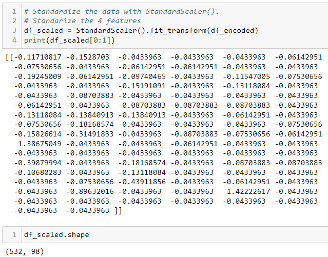
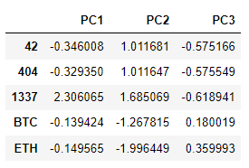
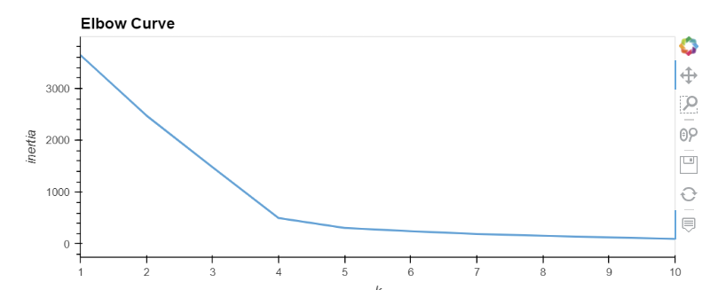
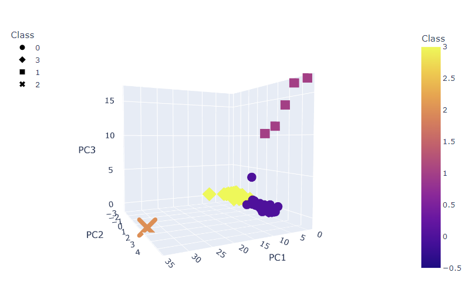
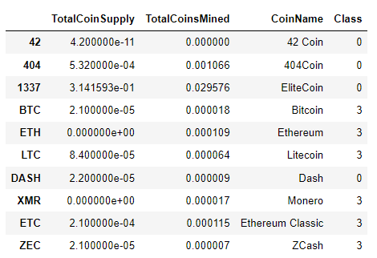
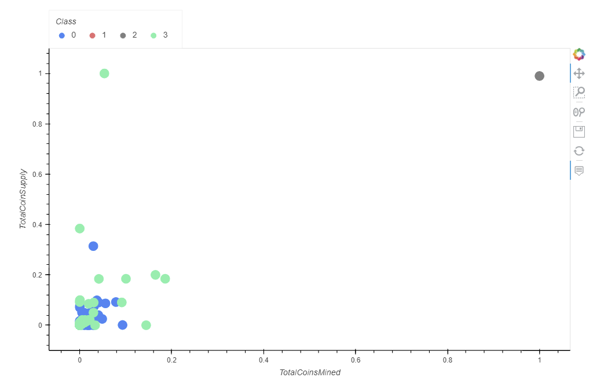
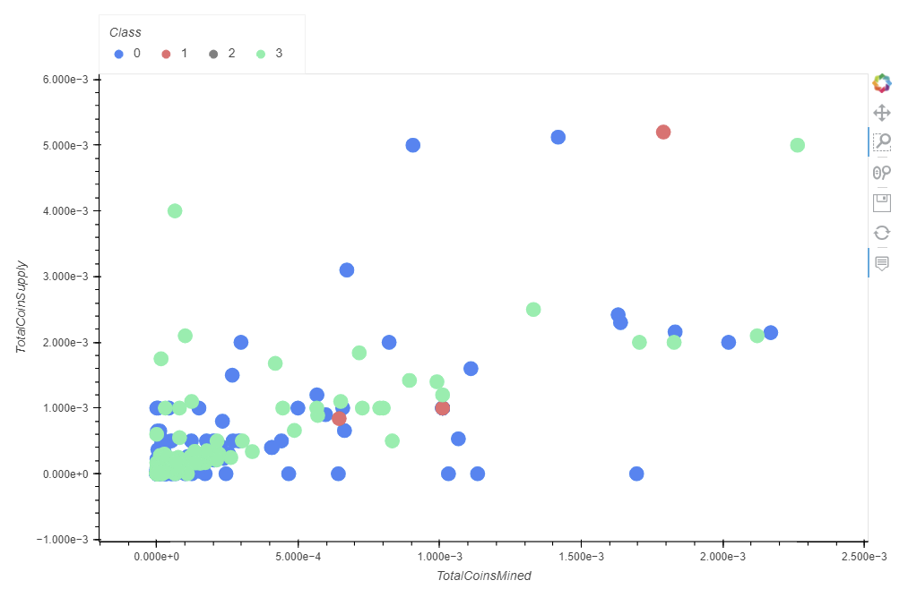

# Cryptocurrencies

## Overview

The objective of this module (**Module 18: Unsupervised Machine Learning and Cryptocurrencies**) is to conduct unsupervised machine learning (ML) on a cryptocurrencies dataset.

Analyzing this dataset will help to assess what are the best cryptocurrencies to invest in.

## Resources

### List of Applications Used

The Scikit-learn and the Imbalanced-learn libraries are used to conduct machine learning in Python.

- _Python 3.9_
- _Scikit-learn 1.1_
- _Plotly 5.11.0_
- _hvplot 0.8.2_
  _Pandas 1.5.2_

### Input Datasets

- **[Cryptocurrency Data](./crypto_data.csv)**
- **[Starter Code](https://static.bc-edx.com/data/do-v1/m18/starter/Starter_Code.zip)**

## Deliverables

The following is the list of the requested and the provided deliverable files for this modules's challenge.

### Requested Deliverables

- **Deliverable 1.** Preprocessing the Data for PCA
- **Deliverable 2.** Reducing Data Dimensions Using PCA
- **Deliverable 3.** Clustering Cryptocurrencies Using K-means
- **Deliverable 4.** Visualizing Cryptocurrencies Results

### Provided Deliverables

- **[Code](./crypto_clustering.ipynb)**
- **[Images of Results](./Images/)**
- **[Written Analysis](./README.md)**

## Methodolody

**Deliverable 1. Preprocessing the data for PCA.**

1. Read-in the input data.
2. The following preprocessing steps have been performed on the crypto_df DataFrame:

- All cryptocurrencies that are not being traded are removed.
- The IsTrading column is dropped.
- All the rows that have at least one null value are removed.
- All the rows that do not have coins being mined are removed.
- The CoinName column is dropped.

3. A new DataFrame is created that stores all cryptocurrency names from the CoinName column and retains the index from the crypto_df DataFrame.
4. The get_dummies() method is used to create variables for the text features, which are then stored in a new DataFrame, X.
5. The features from the X DataFrame have been standardized using the StandardScaler fit_transform() function.

**Deliverable 2. Reducing the dimensions using PCA.**

1. The PCA algorithm reduces the dimensions of the X DataFrame down to three principal components.
2. The pcs_df DataFrame is created and has the following three columns, PC 1, PC 2, and PC 3, and has the index from the crypto_df DataFrame.

**Deliverable 3. Clustering the Cryptocurrencies using K-means.**

The K-means algorithm is used to cluster the cryptocurrencies using the PCA data, where the following steps have been completed:

1. An elbow curve is created using hvPlot to find the best value for K.
2. Predictions are made on the K clusters of the cryptocurrencies’ data.
3. A new DataFrame is created with the same index as the crypto_df DataFrame and has the following columns: Algorithm, ProofType, TotalCoinsMined, TotalCoinSupply, PC 1, PC 2, PC 3, CoinName, and Class.

**Deliverable 4. Visualizing Cryptocurrencies Results.**

1. The clusters are plotted using a 3D scatter plot, and each data point shows the CoinName and Algorithm on hover.
2. A table with tradable cryptocurrencies is created using the hvp.lot.table() function.
3. The total number of tradable cryptocurrencies is printed
4. A DataFrame is created that contains the clustered_df DataFrame index, the scaled data, and the CoinName and Class columns.
5. A hvplot scatter plot is created where the X-axis is "TotalCoinsMined", the Y-axis is "TotalCoinSupply", the data is ordered by "Class", and it shows the CoinName when you hover over the data point.

_Image 1: Deliverable1. Data Standarized with StandardScaler()_.

_Image 2: Deliverable 2. Principal Components Data Frame_.

_Image 3: Deliverable 3. K-Means Elbow Curve_.

_Image 4a: Deliverable 4. 3D Scatter Plot With K-Means Clusters_.

_Image 4b: Deliverable 4. Cryptocurrencies table with predicted classes_.

_Image 4c: Deliverable 4. Cryptocurrencies 2D scatter plot_.

_Image 4d: Deliverable 4. Cryptocurrencies 2D scatter plot (zoom in)_.

## Summary

Image 4c, displayes a big cryptocurrency outlier belonging to the Class 2. Furthermore, Class 2 and 1 have few samples, this can be observed in Images 4c and 4d.

Cryptocurrencies belonging to Class 0 and 3 are more stable and thus they are recommended for investment.
